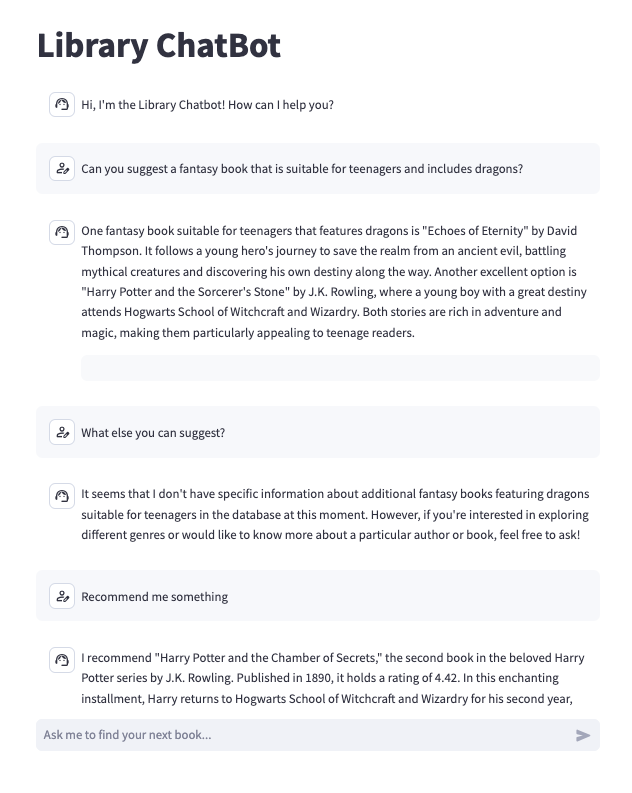

# Library ChatBot Project

This project includes a Library ChatBot implemented using Streamlit, designed to interactively help users find books and provide information about them. The backend utilizes a Neo4j database and incorporates OpenAI's language model for generating responses based on book data.

## Features

- **Interactive Chat Interface**: Engage with the chatbot directly through a user-friendly interface.
- **Advanced Query Handling**: Utilizes natural language processing to interpret and respond to user queries about book plots, genres, and authors.
- **Neo4j Database Integration**: Leverages a graph database to retrieve book information efficiently.
- **Embedding-Based Search**: Uses OpenAI's language model embeddings to enhance search capabilities within the Neo4j database.

## Technology Stack

- **Streamlit** 
- **Neo4j**
- **OpenAI API**
- **Langchain**
- **Docker**

## Setup

### Prerequisites

- Docker
- Docker Compose
- An OpenAI API key
- Neo4j database credentials

### Environment Variables

Create a `.env` file in the root directory and update it with your credentials:

```plaintext
NEO4J_URI=neo4j://<host>:<port>
NEO4J_USERNAME=<username>
NEO4J_PASSWORD=<password>
OPENAI_API_KEY=<your_openai_api_key>
EMBEDDING_MODEL=<your_preferred_openai_model>
DIMENSIONS=<embedding_dimensions>
SIMILARITY_FUNCTION=<similarity_function>
```




[View Presentation PDF](./asserts/Presentation_1.pdf)


